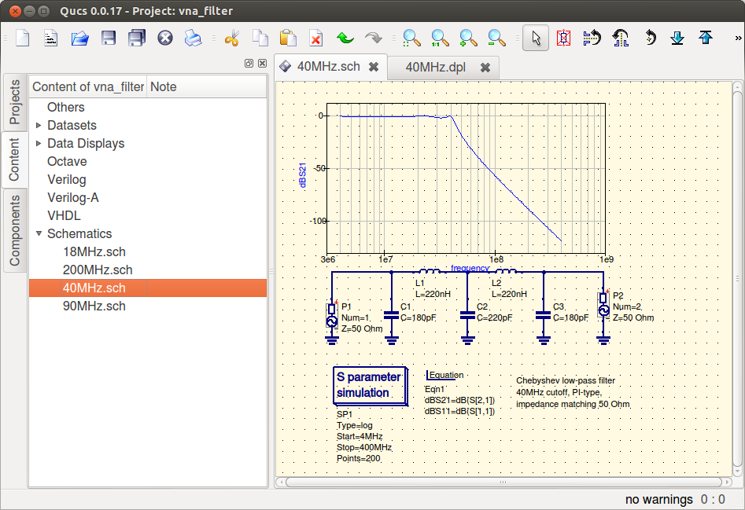
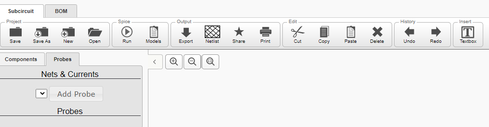

# Analysis

# Existing Solutions

## [Qucs](https://sourceforge.net/projects/qucs)

### What I Like:

 - GUI program, not CLI.
 - Drag & drop of components onto a canvas.
 - Can import/export circuits.
 - Can simulate circuits.

## What I Dislike:

 - Massively complicated - menus inside menus with
	buried functionality.
 - Unsuitable for students - many components
	irrelevant to the GCSE.

## [Partsim](https://www.partsim.com/simulator)

### What I Like:

 - Has less menus than QUCS, is easier to navigate.
 - Can import/export circuits.
 - Can simulate circuits.

### What I Dislike:

 - It is a web app, so is not native and uses up a lot of
	computing power.
 - It is made for companies, not students.
 - Too many components irrelevant to the GCSE.

## Paper-based

### What I Like:

 - Much better for teaching students
 - Shows all the calculations.

### What I Dislike:

 - Some required calculations are not needed for the
	GCSE, so the students would need to learn lots
	of irrelevant equations.
 - Takes up a large amount of time.
 - Can have errors that will be taken forward.

---

# Research Questions

---

# Requirements

## Mac OSX:

 - Mac OSX 10.10 or greater.
 - 64 bit.
 - 2GiB RAM

## Windows:

 - Windows 7 or greater.
 - 64 bit.
 - 2GiB RAM

## Linux:

 - RHEL 7 or equivalent.
 - 64 bit.
 - 2GiB RAM
