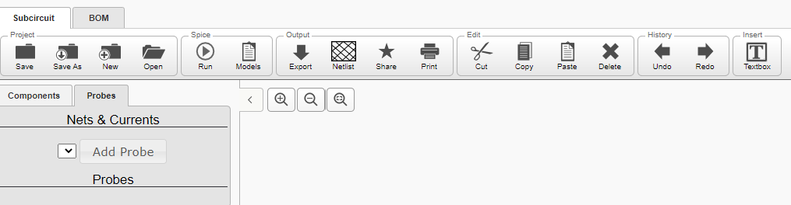

# Analysis

## Existing Solutions

### [Qucs](https://sourceforge.net/projects/qucs)

- GUI program.
- Massively complicated.
- Unsuitable for students - very hard to understand.
- Many components that are just irrelevant to students.
- Circuits entered with a drag and drop GUI, which is an excellent feature which
	I would like to implement.
- Many menus with far too many features.
- Simulation button is buried inside many menus, creates many dialogs that
	make it hard to use.
- Can export/import circuits.
- Can simulate circuits.

### [Partsim](https://www.partsim.com/simulator)

- Web app.
- Mainly for circuit design for companies.
- Easier with fewer menus/buttons.
- Still has many more features than I want in my program.
- Can export/import circuits.
- Can simulate circuits.

