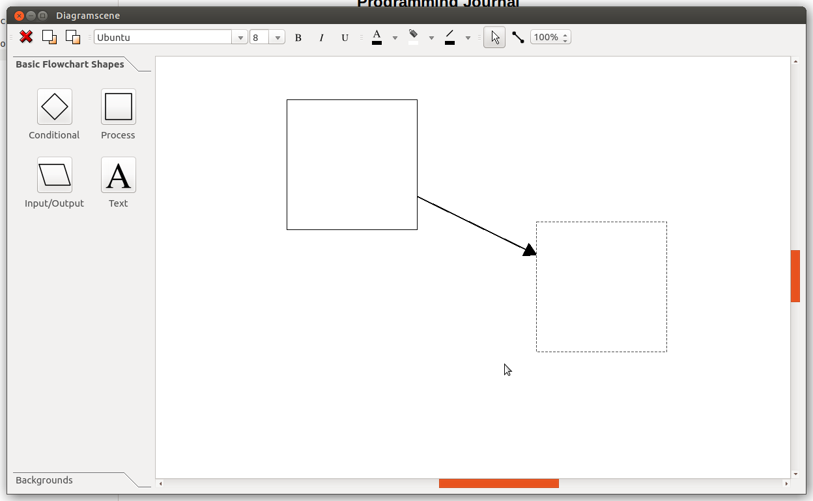
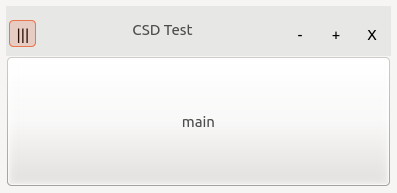
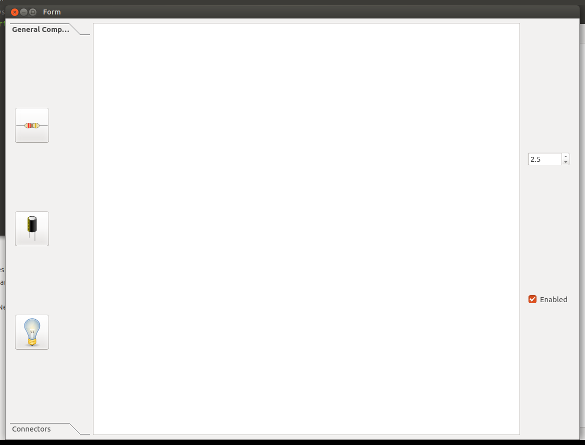

# Programming Journal


## 08/01/2021
Investigated the 
[Diagram Scene Example](https://doc.qt.io/qt-5/qtwidgets-graphicsview-diagramscene-example.html)

Downloaded and built this to figure out how to use the core QGraphicsScene.



---

## 11/01/2021
Started my first test of the QGraphicsScene, removing a lot of 
functionality that is not required, e.g:

- Adding text
- Background colour switching

---

## 15/01/2021
Made a base component class that will be the parent
of all the components in my project:

```
#ifndef SPICE_COMPONENT_H
#define SPICE_COMPONENT_H

#include <string>
#include <vector>

#include <QGraphicsPixmapItem>
#include <QPainter>

struct info{
    float current;
    float voltage;
    float resistance;
};

using namespace std;

class Component{
protected:
    string name;
    int id;

	static QPixmap loadResource(const QString& resource);

public:
	Component* next;
	Component* head;

    inline string getName(){
        return name;
    };

    virtual vector<Component> getConnected() = 0;
    virtual info input(info i) = 0;


};

#endif //SPICE_COMPONENT_H
```

This is able to load component images, is able to pass around a struct
of the required fields for power calculations, 
and will be able to easily be called in a LinkedList, as there is 
the next and head nodes.

There is a space for the image to be loaded from a file (or program resource)
to a QPixmap, which is what is needed for the various QT buttons,
icons, toolbars, etc.

---


## 18/01/2021

Attemped an alternative layout engine, QtQuick, as it is newer, more supported,
and allows buttons inside of the titlebar.

I quickly realised
that it would be unsuitable, as it does not work with
QGraphicsScene.

```
import QtQuick 2.12
import QtQuick.Window 2.12
import WidgetItem 1.0

Window {
    visible: true
    width: 450
    height: 70
    title: qsTr("Hello Widget")

    Rectangle {
        anchors.fill: parent
        Text {
            id: text
            anchors.margins: 20
            text: "This text is created with QML, the item below is a QWidget:"
        }

        WidgetItem {
            anchors.top: text.bottom
            anchors.topMargin: 15
            width: parent.width
            height: parent.height - text.height
        }
    }

    Shortcut {
        sequence: "Ctrl+q"
        onActivated: Qt.quit()
    }
}
```

---

## 22/01/2021

I began an attempt to put buttons in normal QT headerbars, and
was easily able to do it with only a couple of classes.

```
#ifndef CSD_CUSTOMTITLEBAR_H
#define CSD_CUSTOMTITLEBAR_H

#include <QSize>
#include <QEvent>
#include <QLabel>
#include <QPoint>
#include <QWidget>
#include <QPainter>
#include <QMainWindow>
#include <QHBoxLayout>
#include <QMouseEvent>
#include <QPaintEvent>
#include <QPushButton>
#include <QStyleOption>

namespace TitleAttrs {
    enum WindowButton {
        Minimize = 0x01,
        Maximize = 0x02,
        Close    = 0x04,
        All      = Minimize | Maximize | Close
    };

    Q_DECLARE_FLAGS(WindowButtons, WindowButton)
    Q_DECLARE_OPERATORS_FOR_FLAGS(WindowButtons)
}

class CustomTitlebar : public QWidget{
    Q_OBJECT
    Q_PROPERTY(TitleAttrs::WindowButtons windowButtons READ windowButtons WRITE setWindowButtons)
    Q_CLASSINFO("custom_obj_type", "QTitleBar")

public:
    explicit CustomTitlebar(QWidget *parent = nullptr);

    void setWindowButtons(TitleAttrs::WindowButtons btns);
    inline QCustomAttrs::WindowButtons windowButtons() const { return this->m_frameButtons; }

protected:
    void paintEvent(QPaintEvent *event) override;
    void mouseMoveEvent(QMouseEvent *event) override;
    void mousePressEvent(QMouseEvent *event) override;
    void mouseDoubleClickEvent(QMouseEvent *event) override;

private:
    bool canMove;
    bool maximizing;

    QPoint m_pCursor;
    const QSize FRAME_BUTTON_SIZE;

    QWidget* m_parentWindow;

    TitleAttrs::WindowButtons m_frameButtons;

    QLabel lbl_windowTitle;
    QHBoxLayout m_layout;

    QPushButton btn_minimize;
    QPushButton btn_maximize;
    QPushButton btn_close;
    QPushButton btn_menu;

signals:
    void requestClose();
    void requestMaximize();
    void requestMinimize();

};


#endif //CSD_CUSTOMTITLEBAR_H
```

---

## 25/01/2021

Completed the CSD headerbar, as shown below:



A custom window was needed to override the normal window painting.
This means that I needed to learn about QPainter, which
was required for the draggable widgets anyway.

---

## 29/01/2021

Setup main [git repository](https://github.com/radams15/CircuitTester/tree/bd95c868b0d5e83740a9e34a16039be8c44860b2)
, along with the build environment and 
testing suite.

This will allow me to run automated tests with my builds, and identify
any errors that I might create.

---

## 01/02/2021

Made a simple GUI design in QT Creator.

This is not any actual part of my program, but
it serves as a simple design tool.

I simple python script was used to run my design.

```
# -*- coding: utf-8 -*-

################################################################################
## Form generated from reading UI file 'layoutJbelSx.ui'
##
## Created by: Qt User Interface Compiler version 5.15.2
##
## WARNING! All changes made in this file will be lost when recompiling UI file!
################################################################################

from PySide2.QtCore import *
from PySide2.QtGui import *
from PySide2.QtWidgets import *


class Ui_Form(object):
    def setupUi(self, Form):
        if not Form.objectName():
            Form.setObjectName(u"Form")
        Form.resize(1148, 886)
        self.centralwidget = QWidget(Form)
        self.centralwidget.setObjectName(u"centralwidget")
        self.horizontalLayout = QHBoxLayout(self.centralwidget)
        self.horizontalLayout.setObjectName(u"horizontalLayout")
        self.toolBox = QToolBox(self.centralwidget)
        self.toolBox.setObjectName(u"toolBox")
        self.toolBox.setEnabled(True)
        sizePolicy = QSizePolicy(QSizePolicy.Minimum, QSizePolicy.Minimum)
        sizePolicy.setHorizontalStretch(0)
        sizePolicy.setVerticalStretch(0)
        sizePolicy.setHeightForWidth(self.toolBox.sizePolicy().hasHeightForWidth())
        self.toolBox.setSizePolicy(sizePolicy)
        self.toolBox.setMinimumSize(QSize(100, 0))
        self.toolBox.setMaximumSize(QSize(160, 16777215))
        self.page = QWidget()
        self.page.setObjectName(u"page")
        self.page.setGeometry(QRect(0, 0, 160, 814))
        sizePolicy.setHeightForWidth(self.page.sizePolicy().hasHeightForWidth())
        self.page.setSizePolicy(sizePolicy)
        self.verticalLayout = QVBoxLayout(self.page)
        self.verticalLayout.setObjectName(u"verticalLayout")
        self.toolButton_2 = QToolButton(self.page)
        self.toolButton_2.setObjectName(u"toolButton_2")
        icon = QIcon()
        icon.addFile(u"LayoutTest1/images/resistor.png", QSize(), QIcon.Normal, QIcon.Off)
        self.toolButton_2.setIcon(icon)
        self.toolButton_2.setIconSize(QSize(64, 64))

        self.verticalLayout.addWidget(self.toolButton_2)

        self.toolButton = QToolButton(self.page)
        self.toolButton.setObjectName(u"toolButton")
        icon1 = QIcon()
        icon1.addFile(u"LayoutTest1/images/capacitor.png", QSize(), QIcon.Normal, QIcon.Off)
        self.toolButton.setIcon(icon1)
        self.toolButton.setIconSize(QSize(64, 64))

        self.verticalLayout.addWidget(self.toolButton)

        self.toolButton_3 = QToolButton(self.page)
        self.toolButton_3.setObjectName(u"toolButton_3")
        icon2 = QIcon()
        icon2.addFile(u"LayoutTest1/images/bulb.png", QSize(), QIcon.Normal, QIcon.Off)
        self.toolButton_3.setIcon(icon2)
        self.toolButton_3.setIconSize(QSize(64, 64))

        self.verticalLayout.addWidget(self.toolButton_3)

        self.toolBox.addItem(self.page, u"General Components")
        self.page_2 = QWidget()
        self.page_2.setObjectName(u"page_2")
        self.page_2.setGeometry(QRect(0, 0, 160, 814))
        sizePolicy.setHeightForWidth(self.page_2.sizePolicy().hasHeightForWidth())
        self.page_2.setSizePolicy(sizePolicy)
        self.toolBox.addItem(self.page_2, u"Connectors")

        self.horizontalLayout.addWidget(self.toolBox)

        self.graphicsView = QGraphicsView(self.centralwidget)
        self.graphicsView.setObjectName(u"graphicsView")

        self.horizontalLayout.addWidget(self.graphicsView)

        self.verticalFrame = QFrame(self.centralwidget)
        self.verticalFrame.setObjectName(u"verticalFrame")
        self.verticalLayout_2 = QVBoxLayout(self.verticalFrame)
        self.verticalLayout_2.setObjectName(u"verticalLayout_2")
        self.doubleSpinBox = QDoubleSpinBox(self.verticalFrame)
        self.doubleSpinBox.setObjectName(u"doubleSpinBox")
        self.doubleSpinBox.setDecimals(1)
        self.doubleSpinBox.setSingleStep(0.500000000000000)
        self.doubleSpinBox.setValue(2.500000000000000)

        self.verticalLayout_2.addWidget(self.doubleSpinBox)

        self.checkBox = QCheckBox(self.verticalFrame)
        self.checkBox.setObjectName(u"checkBox")
        self.checkBox.setChecked(True)

        self.verticalLayout_2.addWidget(self.checkBox)


        self.horizontalLayout.addWidget(self.verticalFrame)

        Form.setCentralWidget(self.centralwidget)

        self.retranslateUi(Form)

        self.toolBox.setCurrentIndex(0)


        QMetaObject.connectSlotsByName(Form)
    # setupUi

    def retranslateUi(self, Form):
        Form.setWindowTitle(QCoreApplication.translate("Form", u"Form", None))
        self.toolButton_2.setText(QCoreApplication.translate("Form", u"...", None))
        self.toolButton.setText(QCoreApplication.translate("Form", u"...", None))
        self.toolButton_3.setText(QCoreApplication.translate("Form", u"...", None))
        self.toolBox.setItemText(self.toolBox.indexOf(self.page), QCoreApplication.translate("Form", u"General Components", None))
        self.toolBox.setItemText(self.toolBox.indexOf(self.page_2), QCoreApplication.translate("Form", u"Connectors", None))
        self.checkBox.setText(QCoreApplication.translate("Form", u"Enabled", None))
    # retranslateUi

```


```
from layout import Ui_Form
from PySide2.QtWidgets import *


app = QApplication([]) # Start an application.

window = QMainWindow()

win = Ui_Form() # Create a window.

win.setupUi(window)

window.show() # Show window

app.exec_() # Execute the App
```



---

## 05/02/2021

---

## 08/02/2021

---

## 12/02/2021

---